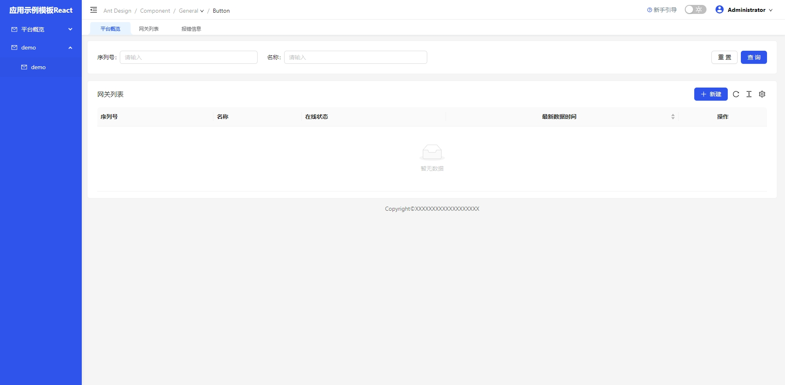
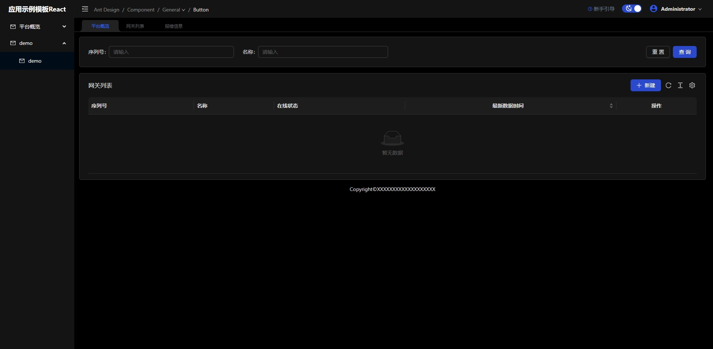

# 中后台管理系统快速初始化模板开发

#### 如果对您的工作有帮助，给作者一个Star吧！！

基于vue3、react的中后台管理系统模板、系统解决方案，帮助快速初始化前端工程项目；

传送门：

[vue3（js）](https://github.com/lunjingjie/vue-react-template/tree/vue-3.x-basic)

[vue3（ts）](https://github.com/lunjingjie/vue-react-template/tree/vue-3.x-ts)

[React18（ts）](https://github.com/lunjingjie/vue-react-template/tree/react-18-ts)

## 功能

-   [x] Ant-design ^5.9.0
-   [x] react ^18.2.0
-   [x] react-redux ^8.1.2
-   [x] 白天/黑夜主题切换
-   [x] 主题色定制
-   [x] 登录页
-   [x] UI组件二次封装
-   [x] 面包屑封装
-   [x] Tab 选项卡封装
-   [x] 多级菜单
-   [x] 自定义图标
-   [x] husky、prettier、eslint、lint-staged

## 安装步骤

- 安装脚手架

```shell
npm i -g knt-tools-cli
knt create my-project
```

- 模板选择

​	vue3.x-javascript

​	vue3.x-typescript

​	react18-typescript

## 项目截图






